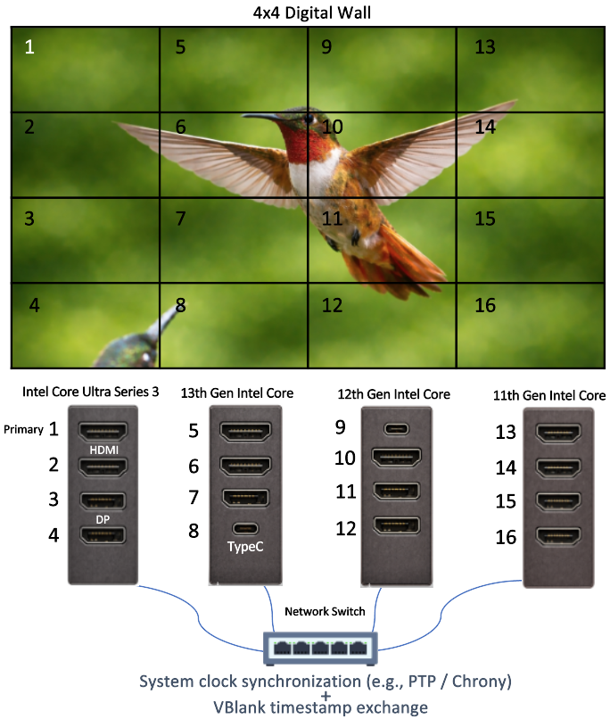

 Copyright (C) 2025 Intel Corporation
 SPDX-License-Identifier: MIT

# Introduction to SW Genlock
SW Genlock is a software-based solution designed to **synchronize the display refresh (vblank) signals** across multiple computer systems with high-precision microsecond-level accuracy. It ensures that the vertical blanking intervals (vblanks) of all connected displays occur in tight alignment, enabling seamless, tear-free visual output across multiple screens. Such synchronization is critical in environments like video walls, virtual reality setups, digital signage, and other multi-display configurations where visual continuity is essential.


## Overview

In use cases such as digital signage, there are typically **two levels of synchronization** required:

* **Low-level synchronization** of the display hardware to align the vblanks across systems, and

* **High-level synchronization** by the application to ensure that decoded frames are delivered in sync with those vblanks.

SW Genlock addresses the **first, low-level synchronization** layer, making sure that the vblank signals are precisely aligned across all participating systems. This provides a reliable foundation for applications to build on and manage frame-level synchronization effectively.

## Key Features of SW Genlock

- **Microsecond-Scale VBlank Synchronization**
  Achieves precise vertical synchronization (vblank) alignment across distributed systems, ensuring refresh boundaries occur concurrently to maintain seamless multi-display visual coherence.
- **Flexible Integration Options**
  Provides both dynamic (`.so`) and static (`.a`) linking options, enabling integration into diverse deployment environments and application architectures.
- **Low-Level Timing Control & Instrumentation**
  Includes libraries and tools for vblank timestamp acquisition, phase drift estimation, and controlled DPLL frequency modulation via MMIO access, enabling closed-loop phase alignment at the display engine layer.
- **Heterogeneous Platform Support**
  Supports mixed Intel integrated graphics generations (e.g., Tiger Lake, Panther Lake) and common Linux distributions such as Ubuntu 22.04 and 24.04. Compatible with both Precision Time Protocol (PTP) for high-precision synchronization and Chrony for general-purpose deployments, enabling flexible integration across development and production environments.
- **Adaptive Clock Alignment (Optional)**
  Implements a configurable micro-scale frequency learning mechanism that progressively reduces intrinsic inter-DPLL mismatch. This adaptive process increases synchronization intervals over time and enhances long-term stability with minimal overhead.
- **Monitoring & Diagnostics**
  Provides synchronization status reporting, centralized delta logging, and optional visualization tools. The `-M` mode enables the primary node to collect phase offset data from all secondaries for performance analysis and system tuning.
- **FrameSync-Based Visual Inspection Utility**
  Includes a reference FrameSync application that issues synchronized visual updates (e.g., color transitions) aligned to vblank boundaries. This enables intuitive visual verification of refresh alignment across displays and assists in deployment validation.
- **Reference Applications & Integration Examples**
  Offers sample utilities demonstrating practical integration patterns, facilitating adoption within custom display and digital signage systems.

The SW Genlock system operates by aligning the internal clocks of all systems involved, ensuring that every display refresh is triggered simultaneously. This alignment is achieved through the utilization of industry-standard protocols and our advanced algorithms, which manage the synchronization over ethernet or direct network connections.

<div align="center">
  
  <p><em>Figure: SW GenLock Overview</em></p>
</div>

# Supported Platforms

Platforms based on the following architectures should be supported:

- Intel® Core™ 11th Gen (Tiger Lake)
- Intel® Core™ 12th Gen (Alder Lake)
- Intel® Core™ 13th Gen (Raptor Lake)
- Intel® Core™ Ultra Series 1 (Meteor Lake)
- Intel® Core™ Ultra Series 2 (Arrow Lake)
- Next-generation Intel® Core™ client platform (Panther Lake)
- Intel® Arc™ “Battlemage” graphics (B-Series) (Battlemage)

*Codenames are included in parentheses for reference.*

## Important Notes
* This tool requires root privileges (e.g., via sudo) by default, as it accesses the PCI address space directly. Alternatively, users may configure appropriate permissions or use cgroup-based access control to avoid running as root. Please note that the accompanying reference applications do not handle this, and it is the user's responsibility to ensure proper permissions are set up.

* The swgenlock reference application provided is intended for demonstration purposes only. It uses unencrypted socket communication to send and receive VBlank timestamps. Users are strongly encouraged to implement appropriate encryption and security measures for any production or real-world deployment.

* **Kernel Version Consistency (Non-Hammock Harbor Mode)**: When operating in standard synchronization mode (without `-H` flag), it is **recommended that all participating machines run the same kernel version***.

  *This is because the DRM patch adds real-time clock timestamps to vblank messages returned by the kernel to userspace, and the kernel callback where these timestamps are retrieved varies between kernel versions, which may result in timing delay variations that can affect synchronization accuracy. Note that this drift or timing difference between different kernel versions is typically only observable when measuring the actual display signals with an oscilloscope—the sync messages and command console output will still report that systems are in sync. **Hammock Harbor mode (`-H` flag)** is not affected by this consideration, as it obtains timing information directly from display hardware registers rather than relying on kernel-provided timestamps, making it immune to kernel version differences across participating systems. Note that when using Hammock Harbor mode, **all participating systems must run with the `-H` flag** to ensure consistent timestamping methodology across all nodes.

# Installation

Installing SW Genlock involves a certain steps. This section guides through the process of setting up SW Genlock on target systems, ensuring that user have everything needed to start synchronizing displays.

## System Requirements
Follow **[System Requirements](./docs/requirements.md)**

## Build Steps
Follow **[Build Steps](./docs/build.md)**

## Reference Applications

Four reference applications are provided to demonstrate effective library usage:

### swgenlock - Multi-System Synchronization
The primary synchronization application that operates in primary (server) or secondary (client) mode for multi-system genlock. It supports both Ethernet and IP-based communication, enabling precise vblank alignment across multiple systems. Features include continuous drift monitoring, adaptive learning mode, and support for pipelock mode (single-system multi-pipe synchronization).

**→ For complete usage guide, examples, and troubleshooting, see [swgenlock documentation](./docs/swgenlock.md)**

### pllctl - PLL Frequency Control
A utility for manual PLL frequency adjustment and drift testing on a single system. Allows direct setting of PLL clock values, introduces controlled drift for testing synchronization methodology, and supports stepped frequency adjustments to prevent display blanking during large frequency changes.

**→ For complete usage guide, examples, and troubleshooting, see [pllctl documentation](./docs/pllctl.md)**

### vblmon - VBlank Monitoring
A monitoring tool that displays average vblank period for verification and validation. Useful for measuring synchronization accuracy and validating that displays are operating at expected refresh rates. Supports both software and hardware timestamping modes.

**→ For complete usage guide, examples, and troubleshooting, see [vblmon documentation](./docs/vblmon.md)**

### framesync - Synchronized Frame Presentation Demo
A visual demonstration application that showcases synchronized frame presentation across multiple displays and systems. Changes solid colors simultaneously on all screens at precisely the same moment, providing clear visual confirmation that swgenlock is working correctly. Uses primary/secondary architecture with configurable color change intervals.

**→ For complete usage guide, examples, and troubleshooting, see [framesync documentation](./docs/framesync.md)**

## Quick Start Examples

### Running swgenlock (Multi-System Synchronization)

**Two-System Setup:**

On System A (Primary):
```bash
sudo ./swgenlock -m pri -i 192.168.1.100 -p 0
```

On System B (Secondary):
```bash
sudo ./swgenlock -m sec -i 192.168.1.100 -p 0
```

Wait until status shows "IN SYNC". For more options and configurations, see [swgenlock documentation](./docs/swgenlock.md).

### Running pllctl (Manual PLL Control)

**Monitor vblank interval on pipe 0:**
```bash
sudo ./pllctl -p 0
```

**Set specific clock frequency:**
```bash
sudo ./pllctl -p 0 -f 160000000.5
```

For more advanced usage, see [pllctl documentation](./docs/pllctl.md).

### Running vblmon (VBlank Monitoring)

**Monitor pipe 0:**
```bash
sudo ./vblmon -p 0
```

**Monitor with custom sample count:**
```bash
sudo ./vblmon -p 0 -n 100
```

For more options, see [vblmon documentation](./docs/vblmon.md).

### Running framesync (Visual Sync Demonstration)

**Prerequisites:** Start swgenlock first and wait for "IN SYNC" status.

**Two-System Color Sync:**

On System A (Primary):
```bash
./framesync -m primary -p 5555 -P 0 -t 2000 -f
```

On System B (Secondary):
```bash
./framesync -m secondary -I 192.168.1.100 -p 5555 -P 0 -f
```

Both displays will change colors simultaneously every 2 seconds, providing visual confirmation of synchronization.

**Single System, Two Monitors (Pipelock Mode):**

First, start swgenlock in pipelock mode:
```bash
sudo ./swgenlock -m pipelock -P 0 -p 1
```

Then start framesync for each display:
```bash
# Terminal 1 - Primary on pipe 0
./framesync -m primary -p 5555 -P 0 -t 1000 -f

# Terminal 2 - Secondary on pipe 1
./framesync -m secondary -I 127.0.0.1 -p 5555 -P 1 -f
```

For complete usage guide including controls, parameters, and troubleshooting, see [framesync documentation](./docs/framesync.md).

## Multi-Secondary Support

The SW GenLock reference application supports two modes of communication between the primary and secondary systems: IP-based and Ethernet-based.

### IP-Based Communication

In IP mode, multiple secondary instances can be connected to a single primary. These secondary instances may run on:

* A single machine, or

* Multiple machines across the network

Since IP networking supports distinct ports for data separation, communication remains reliable even when multiple secondary nodes are running on the same system or interface. This mode is therefore the preferred choice for setups involving more than one secondary.

### Ethernet-Based Communication

In Ethernet mode, one primary-to-one secondary communication works reliably. Even having one secondary per machine is acceptable.

However, if multiple secondary instances run on the same machine using a single NIC, communication issues arise. This is because raw Ethernet frames do not support port-based separation, causing the send/receive data to get mixed up across secondary instances on the same interface.


For multi-secondary setups, especially when running multiple instances on the same system or network interface, **IP-based communication** is strongly recommended to avoid data conflicts and ensure stable operation.

# SW GenLock Key Features

## Hardware Timestamping Support

Recent Intel platforms (Panther Lake onwards) introduce **hardware-based timestamping** for vertical blanking (vblank) events. Dedicated display engine registers capture the exact moment of vblank in hardware, providing **nanosecond-level accuracy**.

### Why Hardware Timestamping?
Traditionally, vblank events are timestamped using the kernel’s `CLOCK_REALTIME` or `CLOCK_MONOTONIC` clocks. This software-based path can be affected by:
- Interrupt dispatch latency (often ~100–200 µs)
- Kernel scheduling overhead
- Adjustments applied by NTP/Chrony to system clocks

With hardware timestamping:
- The timestamp is latched by the display engine at the vblank edge
- Accuracy improves to the nanosecond range
- Measurements more closely reflect the **true display scanout boundary**

### How to Enable
Enable this feature with the `-H` (no argument) option:
```bash
./swgenlock -H
```

When `-H` is specified:

* Vblank timestamps are derived directly from display hardware registers
* The kernel clock is used only as a reference if conversion is required
* Output logs and event dumps will include hardware-derived timestamps instead of software-based ones

### Notes

* Hardware timestamping is available only on platforms that implement this feature
* On unsupported systems, the -H option has no effect and the code falls back to kernel-based timestamping
* **Critical**: For Software GenLock setups using Hammock Harbor mode, **all participating systems must run with the `-H` flag**. Mixed setups (some systems with `-H` and others without) will not synchronize reliably, as they use fundamentally different timestamping methodologies
* For multi-system synchronization, hardware timestamps can be mapped to wall clock time using PTP or Chrony
* **Kernel Version Independence**: Unlike standard mode, Hammock Harbor mode (`-H`) obtains timing directly from display hardware registers, making it independent of kernel version differences. This eliminates the need for matching kernel versions across participating systems, as the DRM patch timestamp retrieval callbacks do not affect hardware register-based timing


## Drift Correction Logic for larger drift
When the time delta between displays exceeds a certain threshold (see `-t` command line parameter), the system supports a two-phase adjustment mechanism to quickly reduce the drift.

The shift value is the desired % difference from current frequency.  0.01 means 0.01% difference (either increase or decrease depending on which side the drift is). If a shift2 value is configured (typically larger than shift), it will be used to accelerate the convergence. However, applying a large shift directly may cause display blanking. To avoid this, the implementation internally breaks shift2 into smaller increments (based on shift) and applies them step-by-step to reach the desired frequency smoothly.  There is a minor delay added to settle down frequency before next step (see `-w` command line parameter).

After a configured timer expires, the same logic is applied in reverse to gradually return the system to its original frequency.

If shift2 is not set (i.e., shift2 = 0), then only shift is used, and no internal stepping is performed. This results in slower convergence but avoids any risk of display instability.

Using shift2 is particularly beneficial during the initial run, when VBlank timestamps between displays may be significantly misaligned. It helps reduce the initial drift quickly, and subsequent synchronization steps use the regular shift value to fine-tune the timing.

When a very small shift is used together with a defined step size and a slightly longer wait time between steps, a minor overshoot is expected. In typical use cases with continuous drift monitoring, this overshoot is automatically corrected over time. However, when testing with pllctl, which runs only a single adjustment cycle, this correction does not take place. Users are advised to experiment and tune the shift, step threshold and wait values according to their specific hardware setup.

## Adaptive Clock Adjustment via Learning Rate (Secondary Mode)

One of the key features of the Software Genlock system is the ability of a secondary system to gradually align its clock with the primary system through **incremental, permanent adjustments**. This mechanism helps reduce the frequency of synchronization events over time.

When the **learning rate** parameter is provided via command line (e.g., `0.00001`), the secondary system does not only apply temporary drift corrections — it also updates its base clock gradually in the direction of the drift. This behavior helps the local clock "learn" and adapt to the long-term behavior of the primary system.

### How It Works

- After each detected clock drift and adjustment, the secondary clock is **permanently nudged** toward the primary clock using the learning rate.
- The adjustment is calculated as:
		new_clock_offset = current_offset + (drift * learning_rate)
- Over time, this reduces the overall drift and **increases the interval between needed sync events**, resulting in a more stable and low-overhead synchronization model.

This tiny correction is applied to the secondary clock base value. With repeated learning cycles, the secondary system adapts and remains closer to the primary clock with minimal intervention.

This learning mechanism is optional and tunable via the command line parameter -l, allowing fine-grained control over synchronization behavior based on system stability and timing accuracy needs.

## 📈 Step-Based Frequency Correction
To achieve smooth and compliant synchronization, SW GenLock applies clock frequency corrections in controlled steps, allowing fast convergence without violating PHY or PLL constraints.

🔹 **Shift 1** – Fine-Grained Correction
Shift 1 represents a small, controlled adjustment to the secondary clock’s frequency, defined as a percentage of the base PLL frequency—typically between 0.01% to 0.1%. This step is used continuously to either slightly speed up or slow down the clock to stay in sync with the primary. It ensures the corrections stay within the compliance limits of the underlying PHY and PLL, enabling stable and gradual convergence.

🔹 **Shift 2** – Rapid Drift Recovery
Shift 2 is triggered when the drift between primary and secondary clocks crosses a defined threshold, such as 1 millisecond. It calculates a larger correction to close the timing gap more quickly. However, instead of applying this large adjustment at once, the correction is split into multiple smaller Shift 1 steps to maintain safe operating limits and avoid abrupt changes that could disrupt system behavior.

This two-step correction model ensures the secondary clock reaches alignment with the primary efficiently and within hardware limitations, even under large initial drift conditions.


## Offset Overshoot Control
This feature allows the secondary clock to intentionally overshoot the ideal alignment point (zero delta) within the permitted drift range. Controlled via the -o parameter (default: 0.0, range: 0.0 to 1.0), it defines how far in the opposite direction the clock is allowed to go before beginning convergence. For example, setting -o 0.5 with a delta of 500 µs shifts the sync target to -250 µs, helping reduce the frequency of corrections and avoiding abrupt PLL adjustments. This results in smoother synchronization and longer stable intervals.


## Data collection and Graph generation
The tool logs key synchronization metrics in CSV format, such as time between sync events, delta values at the point of sync trigger, and the applied PLL frequency. A Python script is included to generate plots that help visualize the system’s behavior over long durations. It is recommended to use a virtual environment (especially on Ubuntu 24.04 or later) to avoid conflicts with system packages. You can create and activate a virtual environment as follows:

```bash
python3 -m venv venv
source venv/bin/activate
pip install matplotlib
```

Now run

```bash
(venv)$ python ./scripts/plot_sync_interval.py ./sync_pipe_0_20250610_110827.csv
```

For real-time monitoring and live visualization of synchronization status across multiple nodes, the tool also supports live monitoring mode with the `-M` flag. This enables the primary node to collect and log sync status from all secondaries, which can be visualized in real-time using the `monitor_live.py` script. See [Real-Time Status Monitoring](docs/swgenlock.md#real-time-status-monitoring) for details.

<div align="center">
<figure>
<figcaption>Figure: Long hour synchronization with Chrony</figcaption></figure>
</div>

**To read graph:​**  The data points show the duration between sync events. With a learning time window of 480 seconds (8 minutes), the secondary PLL clock continued adjusting for approximately the first 1.5 hours. Once the sync interval exceeded 8 minutes, learning stopped, and the system remained stable, consistently maintaining sync intervals longer than 8 minutes. A single dip observed around the 4-hour mark is likely due to a transient issue with Chrony.

This data proves valuable for debugging, performance tuning, and validating sync stability. Additionally, the logged PLL frequency can be reused as a command-line parameter to initialize the application with an optimal frequency, allowing it to skip the learning phase and achieve quicker synchronization.

## Running swgenlock as a Regular User without sudo

While the ptp synchronization section provides methods for configuring passwordless sudo, it may be preferable to operate without using sudo or root privileges. The `swgenlock` application, which requires access to protected system resources for memory-mapped I/O (MMIO) operations at `/sys/bus/pci/devices/0000:00:02.0/resource0`, can be configured to run under regular user permissions. This can be achieved by modifying system permissions either through direct file permission changes or by adjusting user group memberships. Note that the resource path might change in future versions of the kernel. The resource path can be verified by running the application with the `strace` tool in Linux as a regular user and checking for permission denied errors or by examining `/proc/processid/maps` for resource mappings.

### Option 1: Modifying File Permissions

Altering the file permissions to allow all users to read and write to the device resource removes the requirement for root access. This method should be used with caution as it can lower the security level of the system, especially in environments with multiple users or in production settings.

To change the permissions, the following command can be executed:

```bash
sudo chmod o+rw /sys/bus/pci/devices/0000:00:02.0/resource0
sudo chmod o+rw /dev/dri/card0
```

This command allows all users (o) to read and write (rw) to the given device nodes.
Alternatively, user can assign capabilities to the binaries themselves. This is a more targeted—but still powerful—approach that bypasses file-permission checks. These capabilities must be re-applied whenever the binaries are rebuilt or replaced:

```bash
sudo setcap 'cap_dac_override+ep' ./vblmon/vblmon
sudo setcap 'cap_dac_override+ep' ./pllctl/pllctl
sudo setcap 'cap_dac_override+ep' ./swgenlock/swgenlock
```

The cap_dac_override capability allows the program to ignore standard file-permission restrictions, effectively giving it full read/write access to protected resources. Use it only when absolutely necessary.

### Option 2: Configuring User Group Permissions and Creating a Persistent udev Rule

A more secure method is to assign the resource to a specific user group, such as the `video` group, and add the user to that group. This method confines permissions to a controlled group of users. To ensure the changes persist after a reboot, a `udev` rule can be created.

#### Step 1: Create a udev Rule for Persistent Permissions

To make the permissions persist after reboot, create a `udev` rule by adding a new rule file in `/etc/udev/rules.d/`:

```bash
sudo tee /etc/udev/rules.d/99-vsync-access.rules > /dev/null <<'EOF'
# Allow non-root access to Intel GPU MMIO and DRM device nodes
SUBSYSTEM=="pci", ATTR{vendor}=="0x8086", RUN+="/bin/chgrp video /sys/bus/pci/devices/%k/resource0", RUN+="/bin/chmod 660 /sys/bus/pci/devices/%k/resource0"
SUBSYSTEM=="drm", KERNEL=="card*", GROUP="video", MODE="0660"
EOF
```

This rule ensures that the permissions are correctly set when the system boots.

#### Step 2: Reload udev Rules

After creating the rule, reload the udev rules to apply them immediately without rebooting:

```bash
sudo udevadm control --reload-rules && sudo udevadm trigger -s pci -a "vendor=0x8086" && sudo udevadm trigger -s drm
```

#### Step 3: Add the User to the Video Group

Add the user to the video group using this command (replace $USER with the actual user name if needed):

```bash
sudo usermod -a -G video $USER
```

Log out and log back in, or start a new session, for the group changes to take effect.

#### Verifying the Changes

After applying one of the above methods, confirm that the user has the necessary permissions by running the swgenlock application without elevated privileges. If the setup is correct, the application should run without requiring sudo or root access.

## Running ptp4l as a Regular User without sudo

Similarly, the ptp4l command can be executed by a regular user. This can be done by either altering the permissions or modifying the group for `/dev/ptp0`, or by creating a udev rule to ensure persistent permissions.

```bash
echo 'SUBSYSTEM=="ptp", KERNEL=="ptp0", GROUP="video", MODE="0660"' | sudo tee /etc/udev/rules.d/99-ptp-access.rules
```

Reload udev Rules

```bash
sudo udevadm control --reload-rules &&  sudo udevadm trigger
```

However, `phc2sys` will still need to be run with root or sudo privileges as it involves modifying system time. Running it under a normal user account could be possible if permissions to update the system clock are granted to the application.

# Debug Tools

When performing debugging, it is helpful to have the following libraries installed:

```bash
apt install -y intel-gpu-tools edid-decode
```

## Debug Tool Usage

When encountering unexpected behavior that requires additional debugging, the installed tools can assist in narrowing down the potential problem.

**[intel-gpu-tools](https://cgit.freedesktop.org/xorg/app/intel-gpu-tools/)**
Provides tools to read and write to registers, it must be run as the root user. Example:

```console
$ intel_reg dump --all > /tmp/reg_dump.txt

# output excerpt
                    GEN6_RP_CONTROL (0x0000a024): 0x00000400
Gen6 disabled
                      GEN6_RPNSWREQ (0x0000a008): 0x150a8000
               GEN6_RP_DOWN_TIMEOUT (0x0000a010): 0x00000000
           GEN6_RP_INTERRUPT_LIMITS (0x0000a014): 0x00000000
               GEN6_RP_UP_THRESHOLD (0x0000a02c): 0x00000000
                      GEN6_RP_UP_EI (0x0000a068): 0x00000000
                    GEN6_RP_DOWN_EI (0x0000a06c): 0x00000000
             GEN6_RP_IDLE_HYSTERSIS (0x0000a070): 0x00000000
                      GEN6_RC_STATE (0x0000a094): 0x00040000
                    GEN6_RC_CONTROL (0x0000a090): 0x00040000
           GEN6_RC1_WAKE_RATE_LIMIT (0x0000a098): 0x00000000
           GEN6_RC6_WAKE_RATE_LIMIT (0x0000a09c): 0x00000000
        GEN6_RC_EVALUATION_INTERVAL (0x0000a0a8): 0x00000000
             GEN6_RC_IDLE_HYSTERSIS (0x0000a0ac): 0x00000019
                      GEN6_RC_SLEEP (0x0000a0b0): 0x00000000
                GEN6_RC1e_THRESHOLD (0x0000a0b4): 0x00000000
                 GEN6_RC6_THRESHOLD (0x0000a0b8): 0x00000000
...

intel_reg read 0x00062400
                PIPE_DDI_FUNC_CTL_C (0x00062400): 0x00000000 (disabled, no port, HDMI, 8 bpc, -VSync, -HSync, EDP A ON, x1)
```

**[edid-decode](https://manpages.debian.org/unstable/edid-decode/edid-decode.1.en.html)**
is a tool used to parse the Extended Display Identification Data (EDID) from monitors and display devices. EDID contains metadata about the display's capabilities, such as supported resolutions, manufacturer, serial number, and other attributes.

To operate edid-decode, it is typically necessary to supply a binary EDID file or data. Here's an example of how to use it:

```console
$ cat /sys/class/drm/card0-HDMI-A-1/edid > edid.bin

# run edid-decode to parse and display the information
edid-decode edid.bin

# sample output
Extracted contents:
header:          00 ff ff ff ff ff ff 00
serial number:   10 ac 64 a4 4c 30 30 32
version:         01 03
basic params:    80 34 20 78 2e
chroma info:     c5 c4 a3 57 4a 9c 25 12 50 54
established:     bf ef 80
standard:        71 4f 81 00 81 40 81 80 95 00 a9 40 b3 00 01 01
descriptor 1:    4d d0 00 a0 f8 70 3e 80 30 20 35 00 55 50 21 00 00 1a
descriptor 2:    02 3a 80 18 71 38 2d 40 58 2c 45 00 55 50 21 00 00 1e
descriptor 3:    00 00 00 ff 00 43 32 30 30 38 30 4e 50 30 0a 20 20 20
descriptor 4:    00 00 00 fd 00 32 4b 1e 53 11 00 0a 20 20 20 20 20 20
extensions:      01
checksum:        1c

Manufacturer: DEL Model a464 Serial Number 808909324
Made week 12 of 2008
EDID version: 1.3
Digital display
Maximum image size: 52 cm x 32 cm
Gamma: 2.20
DPMS levels: Standby Suspend Off
RGB color display
First detailed timing is preferred timing
Display x,y Chromaticity:
  Red:   0.6396, 0.3300
  Green: 0.2998, 0.5996
  Blue:  0.1503, 0.0595
  White: 0.3134, 0.3291
Established timings supported:
  720x400@70Hz
  640x480@60Hz
  640x480@67Hz
  640x480@72Hz
  640x480@75Hz
  800x600@56Hz
  800x600@60Hz
  ...
Standard timings supported:
  1152x864@75Hz
  1280x800@60Hz
  1280x960@60Hz
  ...
Detailed mode: Clock 148.500 MHz, 509 mm x 286 mm
               1920 2008 2052 2200 hborder 0
               1080 1084 1089
```
