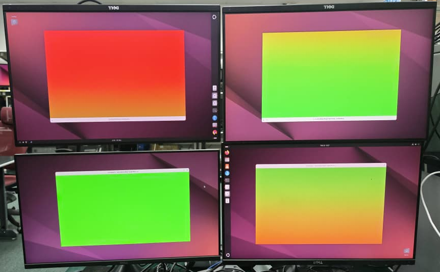
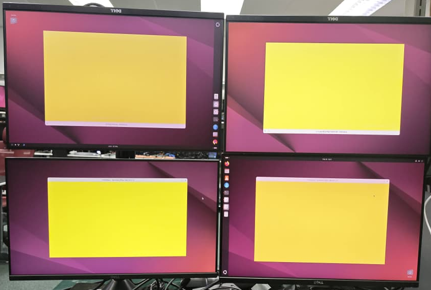

# framesync - Synchronized Frame Presentation Demonstration

## Overview

`framesync` is a visual demonstration application that showcases the synchronized frame presentation capabilities enabled by SW Genlock. It displays solid colors that change simultaneously across multiple monitors and systems, providing clear visual confirmation that all displays are perfectly synchronized.

## Key Features

- **Synchronized Color Changes**: All displays change color at the exact same vblank
- **Primary/Secondary Architecture**: Primary coordinates when color changes occur
- **Configurable Intervals**: Set custom color change intervals in milliseconds
- **Vblank-Level Precision**: Uses vblank counting to ensure perfect synchronization
- **Multiple Display Support**: Works across multiple systems and monitors
- **Auto Color Cycling**: Automatically cycles through predefined colors
- **SDL2 Rendering**: Uses SDL2 for cross-platform graphics support

## How It Works

### Architecture

**Pure UDP Multicast - No TCP Connection Needed**

1. **Primary (Coordinator)**:
   - Decides when color changes should occur based on real-time clock
   - Broadcasts color updates via UDP multicast to group (e.g., 239.1.1.1)
   - Single packet reaches all secondaries simultaneously
   - No client registration or connection management needed

2. **Secondary (Listener)**:
   - Joins the multicast group (e.g., 239.1.1.1)
   - Receives color update commands via UDP multicast
   - Waits until the specified target timestamp
   - Renders the new color at the next vblank after target time

### Synchronization Flow

```
Time ->   T=0ms       T=50ms      T=150ms (target)    T=166ms (vblank)
Primary:  [Red]  → UDP multicast  →  sleep until   →  [Green] render
                       ↓↓↓
                  (single packet)
                       ↓↓↓
Secondary1: [Red]  receives msg       sleep until   →  [Green] render
Secondary2: [Red]  receives msg       sleep until   →  [Green] render
Secondary3: [Red]  receives msg       sleep until   →  [Green] render
```

The primary schedules color changes `N` milliseconds ahead (configurable via `--schedule-ahead`), giving time for the multicast message to reach all secondaries before the target timestamp arrives. All systems then wait until the target timestamp and render at the next vblank for tear-free presentation.

### Network Architecture

```
┌─────────────────────────────────────┐
│  Primary (239.1.1.1:5001 sender)    │
│  - Sends color updates via multicast│
│  - No client tracking needed        │
└──────────────┬──────────────────────┘
               │ UDP Multicast
            ┌──┴───┬────────┬─────────
            ↓      ↓        ↓
      ┌─────────┐ ┌─────────┐ ┌─────────┐
      │Secondary│ │Secondary│ │Secondary│
      │  (Auto) │ │  (Auto) │ │  (Auto) │
      └─────────┘ └─────────┘ └─────────┘
      Automatically joins 239.1.1.1:5001
```

## Prerequisites

### System Requirements

- **SW Genlock running**: This demo requires vblank synchronization between systems
  - Run `swgenlock` in primary/secondary mode before starting `framesync`
  - See [swgenlock documentation](swgenlock.md) for setup instructions

- **SDL2 library**: Graphics rendering library
  ```bash
  # Ubuntu/Debian
  sudo apt-get install libsdl2-dev

  # Fedora/RHEL
  sudo dnf install SDL2-devel
  ```

- **Synchronized system clocks** (for multi-system setups):
  - Use PTP or Chrony to synchronize clocks between systems
  - See [PTP Setup](ptp.md) or [Chrony Setup](chrony.md)

### Installation

```bash
# Build with CMake
cd build
cmake -DBUILD_VSYNC_DEMO=ON ..
make
sudo make install

# Or build with Meson
cd builddir
meson configure -Dbuild_vsync_demo=true
ninja
sudo ninja install
```

## Usage

### Command Line Options

```console
Usage: framesync [options]

Options:
  -m, --mode <mode>         Operating mode: primary or secondary (default: primary)
  -g, --multicast-group <ip> UDP multicast group address (default: 239.1.1.1)
  -p, --multicast-port <port> UDP multicast port (default: 5001)
  -T, --multicast-ttl <ttl>  Multicast TTL: 1=subnet, 32=campus (default: 1)
  -I, --multicast-if <ip>    Multicast interface IP (default: auto-select)
  -P, --pipe <pipe>         Display pipe/connector to use (default: 0)
  -d, --device <device>     DRM device path (default: /dev/dri/card0)
  -t, --interval <ms>       Color change interval in milliseconds (default: 1000)
  -s, --schedule-ahead <ms> Schedule color changes this many ms ahead (default: 33)
  -f, --fullscreen          Run in fullscreen mode
  -W, --width <width>       Window width (default: 1920)
  -H, --height <height>     Window height (default: 1080)
  -v, --log-level <level>   Log level: error, warning, info, debug or trace (default: warning)
  -n, --no-vsync            Disable vsync (not recommended)
  -c, --no-cycle            Disable automatic color cycling
  -h, --help                Display this help message
```

## Usage Examples

### Local Testing (Same Machine, Multiple Pipes)

Perfect for testing with two displays on one system. Multicast loopback is **always enabled** to support mixed deployments (local + network clients simultaneously).

**Step 1: Start swgenlock for vblank synchronization**
```bash
# Synchronize pipe 0 and pipe 1 on same system
sudo ./swgenlock -m pipelock -P 0 -p 1
```

Wait for vblank synchronization to complete (status shows "IN SYNC").

**Step 2: Start framesync on both pipes**

Terminal 1 - Primary on pipe 0:
```bash
./framesync -m primary -g 239.1.1.1 -p 5001 -P 0 -t 1000
```

Terminal 2 - Secondary on pipe 1:
```bash
./framesync -m secondary -g 239.1.1.1 -p 5001 -P 1
```

Both displays will now change colors every second in perfect synchronization.

**Note**: No need to specify server IP or interface - just use the same multicast group!

### Network Deployment (Two Separate Machines)

**Step 1: Start swgenlock for vblank synchronization**

On System A (192.168.1.100) - Primary:
```bash
sudo ./swgenlock -m pri -i 192.168.1.100 -p 0
```

On System B (192.168.1.101) - Secondary:
```bash
sudo ./swgenlock -m sec -i 192.168.1.100 -p 0
```

Wait for vblank synchronization to complete (status shows "IN SYNC").

**Step 2: Start framesync**

On System A (192.168.1.100) - Primary:
```bash
./framesync -m primary -g 239.1.1.1 -p 5001 -I 192.168.1.100 -P 0 -t 2000
```

On System B (192.168.1.101) - Secondary:
```bash
./framesync -m secondary -g 239.1.1.1 -p 5001 -I 192.168.1.101 -P 0
```

**Options explained**:
- `-g 239.1.1.1`: Multicast group (must match on all systems)
- `-p 5001`: Multicast port (must match on all systems)
- `-I <ip>`: Interface IP to use (important for multi-NIC systems)
### Multiple Secondaries (Video Wall)

Multicast scales effortlessly - adding more displays doesn't increase network load!

Primary (System A):
```bash
./framesync -m primary -g 239.1.1.1 -p 5001 -I 192.168.1.100 -P 0 -t 3000
```

Secondary 1 (System B):
```bash
./framesync -m secondary -g 239.1.1.1 -p 5001 -I 192.168.1.101 -P 0
```

Secondary 2 (System C):
```bash
./framesync -m secondary -g 239.1.1.1 -p 5001 -I 192.168.1.102 -P 0
```

Secondary 3 (System D):
```bash
./framesync -m secondary -g 239.1.1.1 -p 5001 -I 192.168.1.103 -P 0
```

All displays will change color simultaneously. **The same single multicast packet reaches all systems** - no sequential delay accumulation!

### Custom Configuration

```bash
# Faster updates (500ms interval), more schedule-ahead time
./framesync -m primary -g 239.1.1.1 -t 500 -s 100 -P 0 -f

# Use different multicast group (useful for multiple independent installations)
./framesync -m primary -g 239.2.2.2 -p 5002 -t 2000

# Windowed mode with specific resolution
./framesync -m secondary -g 239.1.1.1 -W 1280 -H 720

# Campus-wide multicast (TTL=32, covers multiple subnets)
./framesync -m primary -g 239.1.1.1 -T 32 -I 192.168.1.100
```

### Multicast Group Selection

The multicast address `239.x.x.x` range is for private LANs (like `192.168.x.x` for unicast):

- `239.1.1.1` - Default, works for most installations
- `239.2.2.2` - Use different group for independent setups in same building
- `239.255.0.1` - Organization-local scope

**Important**: All primary and secondary instances must use the **same multicast group and port**.

## Controls

- **ESC** or **Q**: Quit the application
- **F11**: Toggle fullscreen mode
- **Close Window**: Click the X button to quit
- **Ctrl+C**: Terminate from terminal
- **Resize Window**: Drag window edges or corners to resize (windowed mode)

**Note**: The window is resizable in windowed mode, and you can toggle between windowed and fullscreen at any time using F11.

## Configuration Parameters

### Interval (-t, --interval)

Controls how often colors change (in milliseconds).

- **1000ms** (default): Change color every second
- **2000ms**: Change color every 2 seconds
- **500ms**: Faster updates (requires lower network latency)
- **5000ms**: Slower updates for demos

### Schedule Ahead (-s, --schedule-ahead)

How many milliseconds ahead to schedule color changes. This gives time for the multicast message to travel across the network before the target timestamp arrives.

- **33ms** (default): Works for most local networks (~2 vblanks at 60Hz)
- **50-100ms**: Better for higher latency or larger networks
- **16ms**: Minimum, only for same-machine or very low latency setups

**Formula**: `schedule_ahead > network_latency + processing_time`

Typical values:
- Same machine (loopback): 16-33ms
- Local LAN (< 1ms latency): 33-50ms
- Campus network (< 10ms latency): 100ms

### Multicast TTL (-T, --multicast-ttl)

Time-to-live (hop limit) for multicast packets:

- **1** (default): Same subnet only (most common)
- **32**: Campus-wide (multiple routers)
- **255**: Unrestricted (not recommended for private use)

### Multicast Loopback

Multicast loopback is **always enabled** to support mixed deployment scenarios where some clients run on the same system as the primary (different display pipes) while others run on separate networked systems. The overhead is negligible (< 1% CPU when enabled but unused), making it safe to always enable without performance concerns.

### Fullscreen and Monitor Placement (-f, --fullscreen)

When using fullscreen mode (`-f`), there is no window title bar to drag the window to a specific monitor. Here are several approaches to control which monitor displays the fullscreen window:

#### Approach 1: SDL Environment Variable (Recommended)

Use the `SDL_VIDEO_FULLSCREEN_DISPLAY` environment variable to specify which monitor (0-indexed):

```bash
# Fullscreen on first monitor (index 0)
SDL_VIDEO_FULLSCREEN_DISPLAY=0 ./framesync -m primary -g 239.1.1.1 -P 0 -f

# Fullscreen on second monitor (index 1)
SDL_VIDEO_FULLSCREEN_DISPLAY=1 ./framesync -m secondary -g 239.1.1.1 -P 1 -f
```

#### Approach 2: Position Then Fullscreen (Easy)

Start in windowed mode, drag the window to the desired monitor, then press **F11** to toggle fullscreen:

```bash
# Start in windowed mode
./framesync -m primary -g 239.1.1.1 -P 0

# Drag window to desired monitor, then press F11 to enter fullscreen
# Press F11 again to exit fullscreen
```

This approach is simple and works on all platforms without requiring environment variables or window manager configuration.

#### Approach 3: Window Manager Placement Rules

Configure your window manager to place framesync on specific monitors:

```bash
# KDE/KWin - use window rules
# GNOME - use devilspie2 or similar tools
# i3/sway - use window assignments in config
```

#### Approach 4: Windowed Mode on Multiple Monitors

For testing and validation, windowed mode without `-f` works well when you need to place windows on different monitors manually. Windows are resizable, so you can adjust their size by dragging edges or corners:

```bash
# Primary on first monitor (manually position and resize as needed)
./framesync -m primary -g 239.1.1.1 -P 0 -W 1920 -H 1080

# Secondary on second monitor (manually position and resize as needed)
./framesync -m secondary -g 239.1.1.1 -P 1 -W 1920 -H 1080

# Or start with smaller windows for easier multi-monitor arrangement
./framesync -m primary -g 239.1.1.1 -P 0 -W 1280 -H 720
```

**Recommendation**: For multi-monitor setups on the same machine:
- Use **Approach 2** (drag + F11) for the simplest experience
- Use `SDL_VIDEO_FULLSCREEN_DISPLAY` with `-f` for automated/scripted deployments

## Demonstrating Swgenlock Value

This demo effectively demonstrates the difference between synchronized and unsynchronized vblanks. To capture the synchronization differences visually, use a camera in burst mode to increase the chances of photographing displays during color transitions (which occur at vblank boundaries every ~16.67ms for 60Hz displays).

### Visual Inspection Methods

There are multiple approaches for visual inspection of frame synchronization:

**Important:** For all camera-based methods, ensure all monitors are captured in the same frame/video simultaneously. This allows direct comparison of color transitions across all displays at the exact same moment, which is essential for verifying synchronization accuracy.

#### Method 1: Long Interval for Real-Time Visual Inspection

Use a longer interval (e.g., 1 second or similar) to visually observe the displays in real-time:

```bash
./framesync -m primary -g 239.1.1.1 -t 1000 -f
```

**Advantages:**
- Easy to observe color changes in real-time
- Get an immediate idea if frames are updating simultaneously
- Suitable for quick testing and demos

**Use Case:** Quick verification that all displays are responding and provide a general sense of synchronization quality.

#### Method 2: Short Interval with Camera Capture

Use a very short interval (e.g., 16ms for 60Hz displays) and capture with a camera in burst mode or snapshot mode:

```bash
./framesync -m primary -g 239.1.1.1 -t 16 -s 50
```

**Advantages:**
- Captures the exact moment of vblank transitions
- Allows detailed inspection after the fact
- More precise for evaluating synchronization accuracy

**Procedure:**
1. Position camera to capture **all displays in the same frame** for direct comparison
2. Set interval to match or be slightly longer than your display's refresh period (16.67ms for 60Hz)
3. Configure camera to burst mode or high-speed snapshot mode
4. Take multiple photos during color transitions
5. Review photos later to identify any synchronization discrepancies

**Use Case:** Precise validation and documentation of synchronization quality. Photos clearly show whether displays change color at the same instant or if there's visible lag.

#### Method 3: Slow Motion Video Recording

Use slow motion video recording (240 fps or higher) to capture color transitions and analyze them frame-by-frame:

```bash
./framesync -m primary -g 239.1.1.1 -t 1000
```

**Advantages:**
- Continuous capture of multiple color transitions in a single recording
- Frame-by-frame playback allows precise analysis of synchronization timing
- High frame rate (240+ fps) reveals even sub-frame differences between displays
- Can measure exact delay in milliseconds by counting frames
- Easier to set up than timed photography - just record and analyze later
- Captures both synchronized and unsynchronized moments for comparison

**Procedure:**
1. Position camera to capture **all displays in the same frame** for direct comparison
2. Set camera to slow motion mode (240 fps minimum, 480 fps or higher preferred)
3. Record for 10-30 seconds while framesync is running
4. Play back the video in slow motion or frame-by-frame
5. Analyze color transitions to verify all displays change simultaneously

**Analysis Tips:**
- At 240 fps, each frame represents ~4.17ms
- At 480 fps, each frame represents ~2.08ms
- Count frames between color changes on different displays to measure delay
- Look for frames where displays show different colors (indicates lack of sync)

**Use Case:** Most comprehensive validation method. Provides a permanent recording for detailed analysis, presentations, and documentation. Especially valuable for demonstrating synchronization quality to stakeholders or troubleshooting intermittent sync issues.

### **Test 1: WITHOUT swgenlock (Bad Case)**
1. Run framesync on all systems
2. Observe/photograph color transitions
3. May use pllctl to forcefully drift participating display if previously run swgenlock.

**Expected Result:** Visible lag between displays (typically 5-15ms). Photos taken during transitions will show **different colors on different displays** - some still showing the old color while others have changed to the new color.

<div align="center">
  
  <p><i>Figure 1: Without swgenlock - displays show different colors during transition</i></p>
</div>


### **Test 2: WITH swgenlock (Good Case)**
1. Run swgenlock on all systems until "IN SYNC"
2. Run framesync on all systems
3. Observe/photograph color transitions

**Expected Result:** All displays change color at the exact same instant. Photos taken during transitions show all displays at the same color.

<div align="center">
  
  <p><i>Figure 2: With swgenlock - both displays show the same color simultaneously (slight variation is expected)</i></p>
</div>

**Why the difference?**
- Both cases use synchronized real-time clocks (PTP/Chrony)
- Both cases wake up at the same target timestamp
- **WITH swgenlock:** Vblanks are aligned in real-time → next vblank happens at same instant
- **WITHOUT swgenlock:** Vblanks drift independently → next vblank happens at different times

This makes a perfect side-by-side comparison demonstrating swgenlock's value for multi-display installations.

## Multicast Networking Requirements

### Network Switch Configuration

For multicast to work across network switches, **IGMP snooping** should be enabled:

```bash
# Check if switch supports IGMP (managed switches only)
# Configuration varies by switch vendor

# Common commands:
# Cisco: ip igmp snooping enable
# HP/Aruba: igmp enable
# Linux bridge: echo 1 > /sys/class/net/br0/bridge/multicast_snooping
```

**Without IGMP snooping**: Multicast packets flood all switch ports (works but inefficient)
**With IGMP snooping**: Switch intelligently forwards only to subscribed ports

### Firewall Configuration

```bash
# Ubuntu/Debian (ufw)
sudo ufw allow in proto udp to 239.1.1.1 port 5001

# iptables
sudo iptables -A INPUT -p udp -d 239.1.1.1 --dport 5001 -j ACCEPT

# firewalld
sudo firewall-cmd --permanent --add-rich-rule='rule family="ipv4" destination address="239.1.1.1" port port="5001" protocol="udp" accept'
sudo firewall-cmd --reload
```

### Testing Multicast

**Test 1: Check if interface supports multicast**
```bash
ip link show | grep MULTICAST
# Should show: UP,BROADCAST,MULTICAST...
```

**Test 2: Monitor multicast traffic**
```bash
# On secondary machine, capture multicast packets
sudo tcpdump -i eth0 -n 'dst host 239.1.1.1 and udp port 5001'
```

**Test 3: Send test multicast**
```bash
# Use socat or netcat to test
echo "test" | socat - UDP4-DATAGRAM:239.1.1.1:5001,bind=0.0.0.0:0
```

### Local vs Network Deployment

| Aspect | Local (Same Machine) | Network (Separate Machines) |
|--------|---------------------|----------------------------|
| Loopback | Always enabled | Always enabled |
| Interface | Auto (`INADDR_ANY`) | Specify with `-I 192.168.x.x` |
| Firewall | Usually not needed | May need multicast rules |
| Switch config | N/A | IGMP snooping recommended |
| Typical schedule-ahead | 16-33 ms | 50-100 ms |

## Troubleshooting

### Colors don't change simultaneously

**Symptoms**: Displays update at different times, visible lag between systems

**Solutions**:
1. Ensure swgenlock is running and displays are in sync
2. Increase schedule-ahead value: `-s 100`
3. Check network latency between systems
4. Verify system clocks are synchronized (PTP/Chrony)

### Secondary shows blank screen / no color updates

**Symptoms**: Secondary starts but never changes colors, shows only initial black screen

**Solutions**:
1. **Verify multicast group and port match**:
   ```bash
   # Both must use same values
   Primary:   -g 239.1.1.1 -p 5001
   Secondary: -g 239.1.1.1 -p 5001
   ```

2. **Check network interface**: Specify interface explicitly:
   ```bash
   Primary:   -I 192.168.1.100
   Secondary: -I 192.168.1.101
   ```

3. **Firewall/network issues**:
   ```bash
   # Allow multicast on firewall
   sudo iptables -A INPUT -p udp -d 239.1.1.1 --dport 5001 -j ACCEPT

   # Check if interface supports multicast
   ip link show | grep MULTICAST

   # Test multicast reception (on secondary machine)
   sudo tcpdump -i eth0 -n 'dst host 239.1.1.1'
   ```

4. **Switch configuration**: Ensure network switch has IGMP snooping enabled

### Network switch doesn't forward multicast

**Symptoms**: Works on same machine but not across network

**Solutions**:
1. Enable IGMP snooping on network switch
2. Some switches require explicit multicast routing configuration
3. Test with direct connection (no switch) to isolate issue
4. Try different multicast group: `-g 239.255.0.1`

### "Failed to join multicast group" error

**Solutions**:
1. Check permissions: May need `sudo` for some network operations
2. Verify interface IP is correct: `ip addr show`
3. Check if interface supports multicast: `ip link show | grep MULTICAST`

### "Failed to initialize renderer"

**Symptoms**: SDL or vsyncalter initialization fails

**Solutions**:
1. Install SDL2: `sudo apt-get install libsdl2-2.0-0`
2. Check DRM device access: `sudo chmod 666 /dev/dri/card0`
3. Run as root if necessary: `sudo ./framesync ...`
4. Verify correct device path: `-d /dev/dri/card0`

### Colors change but not in sync

**Symptoms**: Colors change but with visible delay between systems

**Solutions**:
1. Vblank synchronization may not be working
   - Restart swgenlock
   - Check swgenlock logs for sync errors
2. Increase lookahead: `-l 10`
3. Reduce color change frequency: `-t 3000`

### High CPU usage

**Solutions**:
1. Ensure VSync is enabled (default)
2. Don't use `-n` flag
3. Use fullscreen mode: `-f`

## Technical Details

### Network Protocol

framesync uses **pure UDP multicast** - no TCP connections:

**Color Update Multicast** (Primary → All Secondaries):
- Destination: Multicast group (e.g., 239.1.1.1:5001)
- Protocol: UDP (unreliable but fast)
- Message contains:
  - Target timestamp (real-time, microseconds)
  - Color (RGBA8888)
  - Pattern type
  - Sequence number

**No handshake or registration** - secondaries just join the multicast group and start receiving updates.

### Why UDP Multicast?

**Advantages over TCP unicast**:
- ✅ **Simultaneous delivery**: All clients receive packet at nearly same time
- ✅ **Scalable**: Same performance for 2 or 200 clients
- ✅ **Network efficient**: Single packet on wire regardless of client count
- ✅ **No accumulating delay**: No sequential send delays across clients
- ✅ **Simple**: No connection management, no client registration

**Trade-offs**:
- ⚠️ **UDP unreliable**: Occasional packet loss possible (acceptable for visual sync)
- ⚠️ **Network requirements**: Switches need IGMP snooping
- ⚠️ **Firewall**: May need multicast rules

### Timestamp-Based Synchronization

The demo uses **real-time timestamps** instead of vblank sequence numbers:

1. Primary calculates: `target_time = now + schedule_ahead_ms`
2. Multicast message contains this target timestamp
3. All secondaries receive message with same target time
4. Each waits: `sleep_until(target_time)`
5. Then renders at next vblank for tear-free presentation

This approach requires:
- **Synchronized system clocks** (PTP or Chrony)
- **swgenlock** to align vblanks in real-time

### Vblank Synchronization

The demo relies on:
1. **swgenlock**: Synchronizes vblank timing between systems
2. **libvsyncalter**: Provides:
   - `wait_for_vblank()`: Block until next vblank
   - `get_vblank()`: Query current vblank sequence

This ensures all systems have aligned vblank sequences before color synchronization begins.

## Performance Considerations

- **Network Latency**: Should be < lookahead × 16.67ms (for 60Hz)
- **CPU Usage**: Minimal with VSync enabled
- **GPU Usage**: Minimal (simple solid color fills)
- **Memory Usage**: < 10MB per instance

## Comparison with swgenlock

| Feature | swgenlock | framesync |
|---------|-----------|------------|
| Purpose | Vblank synchronization | Visual demonstration |
| Level | Low-level timing | High-level application |
| Output | Console logs | Visual color changes |
| Dependencies | None (core functionality) | SDL2, swgenlock |
| Required | Yes (for sync) | No (demo only) |

**Important**: Always run `swgenlock` first, then `framesync` on top of it.

## See Also

- [swgenlock documentation](swgenlock.md) - Core synchronization application
- [PTP Setup Guide](ptp.md) - High-precision clock synchronization
- [Chrony Setup Guide](chrony.md) - Alternative clock synchronization
- [Build Instructions](build.md) - How to build the project

## Example Session

### Local Testing (Same Machine)

```bash
# Terminal 1 - Start swgenlock for pipe synchronization
$ sudo ./swgenlock -m pipelock -P 0 -p 1
[INFO] Starting pipelock mode
[INFO] Syncing pipe 0 and pipe 1
...
[INFO] STATUS: IN SYNC (drift: 8 us)

# Terminal 2 - Primary on pipe 0
$ ./framesync -m primary -g 239.1.1.1 -p 5001 -P 0 -t 1000 -v info
[INFO][Px][   0.000] VSync Demo starting...
[INFO][Px][   0.000] Configuration:
[INFO][Px][   0.000]   Mode: primary
[INFO][Px][   0.000]   Multicast: 239.1.1.1:5001 (TTL=1)
[INFO][Px][   0.050] Multicast loopback: enabled (supports mixed local+network deployment)
[INFO][Px][   0.050] Multicast interface: INADDR_ANY (auto-select)
[INFO][Px][   0.050] Multicast socket ready: 239.1.1.1:5001 (TTL=1)
[INFO][Px][   0.210] Renderer initialized: 1280x720, pipe=0, vsync=ON
[INFO][Px][   0.210] Starting color coordination
[DBG][Px][   1.000] Sent update #1: color=0x00FF00FF, target=+50ms, vblank=235
[DBG][Px][   1.050] Color changed to 0x00FF00FF (drift: +5 us, vblank: 238)

# Terminal 3 - Secondary on pipe 1
$ ./framesync -m secondary -g 239.1.1.1 -p 5001 -P 1 -v info
[INFO][Px][   0.000] VSync Demo starting...
[INFO][Px][   0.000] Configuration:
[INFO][Px][   0.000]   Mode: secondary
[INFO][Px][   0.000]   Multicast: 239.1.1.1:5001
[INFO][Px][   0.050] Using multicast interface: INADDR_ANY (auto-select)
[INFO][Px][   0.050] Joined multicast group 239.1.1.1 on port 5001
[INFO][Px][   0.210] Renderer initialized: 1280x720, pipe=1, vsync=ON
[INFO][Px][   0.210] Starting synchronization
[DBG][Px][   1.000] Received multicast update #1 from 127.0.0.1: color=0x00FF00FF (+50 ms until target)
[INFO][Px][   1.050] Color changed to 0x00FF00FF (sequence: #1, drift: +8 us, vblank: 238)
```

### Network Deployment (Two Machines)

```bash
# Terminal 1 - System A (192.168.1.100) - Primary
$ sudo ./swgenlock -m pri -i 192.168.1.100 -p 0
[INFO] Starting primary mode
[INFO] Listening on 192.168.1.100:5000
...

# Terminal 2 - System B (192.168.1.101) - Secondary
$ sudo ./swgenlock -m sec -i 192.168.1.100 -p 0
[INFO] Starting secondary mode
[INFO] Connected to primary
...
[INFO] STATUS: IN SYNC (drift: 15 us)

# Wait for sync, then:

# Terminal 3 - System A (Primary)
$ ./framesync -m primary -g 239.1.1.1 -I 192.168.1.100 -P 0 -t 2000
[INFO] VSync Demo starting...
[INFO] Mode: primary
[INFO] Multicast: 239.1.1.1:5001 (TTL=1)
[INFO] Multicast loopback: enabled (supports mixed local+network deployment)
[INFO] Multicast interface: 192.168.1.100
[INFO] Starting color coordination
[DBG] Sent update #1: color=0x0000FFFF, target=+100ms
[INFO] Color changed to 0x0000FFFF

# Terminal 4 - System B (Secondary)
$ ./framesync -m secondary -g 239.1.1.1 -I 192.168.1.101 -P 0
[INFO] VSync Demo starting...
[INFO] Mode: secondary
[INFO] Multicast: 239.1.1.1:5001
[INFO] Using multicast interface: 192.168.1.101
[INFO] Joined multicast group 239.1.1.1 on port 5001
[INFO] Starting synchronization
[DBG] Received multicast update #1 from 192.168.1.100: color=0x0000FFFF (+98 ms until target)
[INFO] Color changed to 0x0000FFFF (sequence: #1, drift: +12 us)
```

Note: No client connection messages - secondaries just start receiving multicasts automatically!
