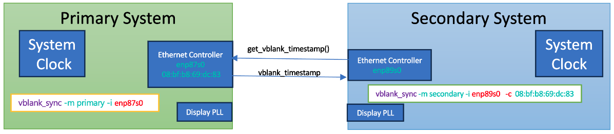

# swgenlock - Multi-System Display Synchronization

## Overview

`swgenlock` is the primary synchronization application of the SW Genlock project, designed to synchronize display refresh (vblank) signals across multiple computer systems with high-precision microsecond-level accuracy. It operates in either primary (server) or secondary (client) mode for multi-system genlock, or in pipelock mode for single-system multi-pipe synchronization.


## Key Features

- **Multiple Operating Modes:**
  - Primary mode (server) - Collects and shares vblank timestamps
  - Secondary mode (client) - Synchronizes with primary system
  - Pipelock mode - Single-system multi-pipe synchronization without network

- **Communication Options:**
  - IP-based communication (recommended for multiple secondaries)
  - Ethernet-based communication (raw Ethernet frames)

- **Advanced Synchronization:**
  - Continuous drift monitoring and automatic re-synchronization
  - Adaptive learning mode with tunable learning rate
  - Hardware timestamping support (Hammock Harbor mode)
  - Step-based PLL frequency correction
  - Offset overshoot control for smoother synchronization

- **Multi-Secondary Support:**
  - Multiple secondary instances per primary
  - IP mode supports multiple instances on same machine/interface


## Prerequisites

### System Clock Synchronization

For multisystem mode, system clocks must be synchronized with **microsecond-level accuracy**:

- **PTP (Recommended)**: Sub-microsecond precision, requires hardware timestamping
- **Chrony**: Tens of microseconds precision, easier setup

See [PTP Setup Guide](ptp.md) and [Chrony Setup Guide](chrony.md) for details.

### Installation

```bash
# Set library path (if using dynamic linking)
export LD_LIBRARY_PATH=/path/to/build/lib:$LD_LIBRARY_PATH

# Copy binaries to both systems or run from build directory
cd build/swgenlock  # or builddir/swgenlock for Meson
```


## Usage

```console
Usage: ./swgenlock [-m mode] [-i interface] [-c mac_address] [-d delta] [-p pipe] [-P primary_pipe] [-s shift] [-v loglevel] [-h]

Options:
  -m mode           Mode of operation: pri, sec, pipelock (default: pri)
                      pri      - Primary mode (server)
                      sec      - Secondary mode (client)
                      pipelock - Primary + Secondary in same process (no network)
  -i interface      Network interface to listen on (primary) or connect to (secondary) (default: 127.0.0.1)
  -c mac_address    MAC address of the network interface to connect to. Applicable to ethernet interface mode only.
  -d delta          Drift time in microseconds to allow before pll reprogramming (default: 100 us)
  -p pipes          Pipe(s) for secondary. Use 4 for all pipes or comma list like 0,1,2,3 (default: 0)
  -P primary_pipe   Primary pipe for pipelock mode (default: -1)
  -s shift          PLL frequency change fraction as percentage (default: 0.01 = 0.01%)
  -x shift2         PLL frequency change fraction for large drift (default: 0.0; Disabled)
  -f frequency      PLL clock value to set at start (default -> Do Not Set : 0.0)
  -e device         Device string (default: /dev/dri/card0)
  -v loglevel       Log level: error, warning, info, debug or trace (default: info)
  -k time_period    Time period in seconds during which learning rate will be applied (default: 240 sec)
  -l learning_rate  Learning rate for convergence. Secondary mode only. e.g 0.00001 (default: 0.0 Disabled)
  -o overshoot_ratio Allow the clock to go beyond zero alignment by a ratio of the delta (value between 0 and 1).
                        For example, with -o 0.5 and delta=500, the target offset becomes -250 us in the opposite direction (default: 0.0)
  -t step_threshold Delta threshold in microseconds to trigger stepping mode (default: 1000 us)
  -w step_wait      Wait in milliseconds between steps (default: 50 ms)
  -M                Enable real-time sync status monitoring and logging (primary and secondary)
  -H                Enable hardware timestamping (Hammock Harbor mode) (default: disabled)
  -n                Use DP M & N Path (default: no)
  -h                Display this help message
```

## Operating Modes

### Primary Mode (Server)

The primary system collects vblank timestamps from its display and shares them with secondary systems over the network.

**Basic Example:**
```bash
# IP-based communication (recommended)
./swgenlock -m pri -i 192.168.1.100 -p 0

# Ethernet-based communication with PTP interface
./swgenlock -m pri -i enp176s0 -p 0
```

**Notes:**
- Primary mode runs as a server, listening for secondary connections
- Specify the network interface or IP address via `-i`
- The `-p` parameter specifies which display pipe to use (0, 1, 2, 3, or 4 for all)

### Secondary Mode (Client)

The secondary system synchronizes its display vblank with the primary system by comparing timestamps and adjusting its PLL frequency.

**Basic Example:**
```bash
# IP-based communication
./swgenlock -m sec -i 192.168.1.100 -p 0 -d 100

# Ethernet-based communication with MAC address
./swgenlock -m sec -i enp176s0 -c 84:47:09:04:eb:0e -p 0 -d 100
```

**With Adaptive Learning:**
```bash
./swgenlock -m sec -i enp176s0 -c 84:47:09:04:eb:0e -p 0 -d 100 -l 0.00001 -k 240
```

**Parameters Explained:**
- `-d 100`: Re-synchronize when drift exceeds 100 microseconds
- `-l 0.00001`: Enable learning mode with specified learning rate
- `-k 240`: Apply learning adjustments for 240 seconds
- `-s 0.01`: Use 0.01% PLL frequency shift for fine adjustments
- `-x 0.1`: Use 0.1% shift for large drift recovery (optional)

**Recommended Drift Threshold:**
- **60-100 µs**: Good balance between sync frequency and tolerance
- Smaller values cause frequent re-syncing
- Larger values (e.g., 1000 µs) allow systems to drift more before correction

<div align="center">
<figure>
<figcaption>Figure: VBlank synchronization setup.</figcaption></figure>
</div>

####  Working principle
In the above examples, we were sync'ing the secondary system  with the primary. However, due to reference clock differences, we see that there is a drift pretty much as soon as we have sync'd them. We also have another capability which allows us to resync as soon as it goes above a threshold.

The secondary system would sync with the primary once but after that it would constantly check to see if the drift is going above 100 us. As soon as it does, the secondary system would automatically resync with the primary. It is recommended to select a large number like 60 or 100 since if we use a smaller number, then we will be resyncing all the time. On the other hand, if we chose a really big number like 1000 us, then we are allowing the systems to get out of sync from each other for 1 ms.

The app features a learning mode as a secondary mode option, where it gradually adjusts the PLL clock to align closely with the primary clock. This adjustment occurs at a specified learning rate, and the app continuously modifies the secondary clock over several iterations and a set duration until it closely mirrors the primary clock, significantly delaying any drift. You can set the learning rate through a command-line parameter, with the default setting being 0, which disables this feature. The time_period parameter defines the duration within which the app responds to any drift by adjusting the clock. If the drift happens after this period has expired, the app does not make permanent adjustments to the PLL clock, assuming it has already closely synchronized with the primary display.

Similar to ptp4l, For user convenience, an automation Bash script is available in the scripts folder to facilitate vsync synchronization on both primary and secondary systems. Users simply need to update the config.sh file with relevant details such as the secondary system's address, username, and Ethernet address, among others. After these updates, run the scripts/run_vsync.sh script from the primary system. This script will automatically copy vblank_sync to secondary under ~/.vblanksync directory and execute the vblank_sync tool on both the primary and secondary systems in their respective modes. Note that the script requires the secondary system to enable passwordless SSH to execute vsyncs commands through the SSH interface.

```console
$ ./scripts/run_vsync.sh
```

### Pipelock Mode (Single-System Multi-Pipe)

Synchronize multiple display pipes within a single system without network communication. One pipe acts as the primary reference while others sync locally.

**Example:**
```bash
# Sync pipes 1, 2, and 3 against pipe 0
./swgenlock -m pipelock -P 0 -p 1,2,3 -d 100 -s 0.01 -l 0.0001
```

**Benefits:**
- Zero network overhead (no TCP required)
- Lower latency (direct memory access)
- Simpler setup (no PTP/Chrony needed)
- Single process operation

**How It Works:**
1. Background thread collects vblank timestamps from primary pipe
2. Secondary pipes capture their own timestamps
3. Secondary pipes read directly from local buffer (no network)
4. Same PLL adjustment algorithms apply

**Notes:**
- All pipes must be on same physical system
- Primary pipe cannot be in secondary pipes list
- All standard secondary parameters work (`-d`, `-s`, `-l`, etc.)

## Advanced Features

### Hardware Timestamping (Hammock Harbor Mode)

Enable nanosecond-level accuracy using dedicated display engine registers (supported platforms only).

```bash
./swgenlock -m pri -i enp176s0 -p 0 -H
./swgenlock -m sec -i enp176s0 -c 84:47:09:04:eb:0e -p 0 -d 100 -H
```

**Important:** All participating systems must use `-H` flag together. Mixed setups will not synchronize reliably.

**Benefits:**
- Timestamp latched at vblank edge by display engine
- Nanosecond-range accuracy
- True display scanout boundary measurement
- Kernel version independent

### Adaptive Learning Mode

Secondary systems can gradually align their clocks with the primary through incremental, permanent adjustments.

```bash
./swgenlock -m sec -i enp176s0 -c MAC_ADDR -d 100 -l 0.00001 -k 240
```

**How It Works:**
- After each drift correction, secondary clock permanently nudges toward primary
- Formula: `new_clock_offset = current_offset + (drift * learning_rate)`
- Over time, drift reduces and sync intervals increase

**Parameters:**
- `-l 0.00001`: Learning rate (smaller = more gradual adjustment)
- `-k 240`: Learning time period in seconds

### Step-Based Frequency Correction

**Shift 1 (Fine-Grained):**
```bash
./swgenlock -m sec ... -s 0.01  # 0.01% frequency shift
```
- Small adjustment (0.01%-0.1% of base PLL frequency)
- Continuous use for gradual convergence
- Stays within PHY/PLL compliance limits

**Shift 2 (Rapid Recovery):**
```bash
./swgenlock -m sec ... -s 0.01 -x 0.1 -t 1000 -w 50
```
- `-x 0.1`: Larger shift for rapid drift recovery
- `-t 1000`: Trigger when drift exceeds 1000 µs (1 ms)
- `-w 50`: Wait 50 ms between steps

Prevents display blanking by splitting large corrections into smaller steps.

### Offset Overshoot Control

Allows intentional overshoot of zero alignment for smoother synchronization.

```bash
./swgenlock -m sec ... -o 0.5 -d 500
```

With `-o 0.5` and `-d 500` µs, the target offset becomes -250 µs (opposite direction), reducing correction frequency and avoiding abrupt PLL adjustments.

### Direct PLL Clock Setting

Set initial PLL frequency to skip learning phase:

```bash
./swgenlock -m sec ... -f 8100.532
```

Use logged PLL frequency from previous runs to achieve quicker synchronization.

## Communication Modes

### IP-Based Communication (Recommended)

**Advantages:**
- Multiple secondaries per primary
- Supports multiple instances on same machine/interface
- Port-based separation ensures reliable communication

**Example:**
```bash
# Primary
./swgenlock -m pri -i 192.168.1.100 -p 0

# Secondary
./swgenlock -m sec -i 192.168.1.100 -p 0 -d 100
```

### Ethernet-Based Communication

**Advantages:**
- Direct Ethernet frames (no TCP/IP overhead)
- One-to-one communication works reliably

**Limitations:**
- Multiple instances on same NIC cause conflicts (no port separation)
- Use IP mode for multi-secondary setups

**Example:**
```bash
# Primary
./swgenlock -m pri -i enp176s0 -p 0

# Secondary
./swgenlock -m sec -i enp176s0 -c 84:47:09:04:eb:0e -p 0 -d 100
```

## Deployment Examples

### Multi-Display Setup (Pipelock Mode)
System Clock Synchronization is not required in single system pipelock mode

**Single System with 4 Displays:**
```bash
# Synchronize pipes 1, 2, and 3 against pipe 0
./swgenlock -m pipelock -P 0 -p 1,2,3 -d 100 -s 0.01 -l 0.0001
```

### Multi-Secondary Setup

**Primary:**
```bash
./swgenlock -m pri -i 192.168.1.100 -p 0
```

**Secondary 1:**
```bash
./swgenlock -m sec -i 192.168.1.100 -p 0,1 -d 100
```

**Secondary 2:**
```bash
./swgenlock -m sec -i 192.168.1.100 -p 0,1,2,3 -d 100
```

## Automation Script

For convenience, use the automation script to run swgenlock on both primary and secondary systems:

1. Update `scripts/config.sh` with system details (IP, MAC address, etc.)
2. Run from primary system:
   ```bash
   ./scripts/run_vsync.sh
   ```

**Note:** Requires passwordless SSH to secondary system.

## Data Collection and Analysis

swgenlock logs synchronization metrics in CSV format:
- Time between sync events
- Delta values at sync trigger
- Applied PLL frequency

**Generate visualization:**
```bash
python3 -m venv venv
source venv/bin/activate
pip install matplotlib
python ./scripts/plot_sync_interval.py ./sync_pipe_0_YYYYMMDD_HHMMSS.csv
```

## Security Notes

**Important:** swgenlock uses **unencrypted socket communication** for demonstration purposes. For production deployments:
- Implement encryption for network communication
- Use VPN or secure network infrastructure
- Apply appropriate authentication mechanisms
- See [Running Without Root Privileges](../README.md#running-swgenlock-as-a-regular-user-without-sudo) for permission configuration

## Real-Time Status Monitoring

The `-M` flag enables live synchronization monitoring, allowing the primary to collect and log sync status from all secondaries.

### How It Works

- Primary runs a monitoring thread listening on UDP port (base_port + 1000)
- Each secondary sends fire-and-forget status updates after computing delta
- Primary logs all status updates to CSV file: `swgenlock_monitor_<timestamp>.csv`
- CSV format: `timestamp_us,node_name,pipe,delta_us`

### Usage

**Enable monitoring on both primary and secondaries:**

```bash
# Primary with monitoring
./swgenlock -m pri -i 192.168.1.100 -p 0 -M

# Secondaries with monitoring
./swgenlock -m sec -i 192.168.1.100 -p 0 -M
./swgenlock -m sec -i 192.168.1.100 -p 0 -M  # Another secondary
```

### Live Visualization

Use the `monitor_live.py` script to visualize sync status in real-time:

```bash
# Auto-detect latest CSV file
python scripts/monitor_live.py

# Specify CSV file
python scripts/monitor_live.py swgenlock_monitor_20260224_143337.csv

# Custom parameters
python scripts/monitor_live.py -w 120 -u 2 -y 200

# Filter to show only specific machines or pipes
python scripts/monitor_live.py -m "desk,workstation"  # Show machines with "desk" or "workstation"
python scripts/monitor_live.py -m "P1"                # Show only pipe 1 from all machines
python scripts/monitor_live.py -m "server-01,P0"      # Show "server-01" or pipe 0
```

**Script Features:**
- Live plotting with configurable time windows (default 60s)
- Supports 64+ displays with automatic color assignment
- Multi-column node info panel showing latest delta for each node
- Toggle between windowed and full data view
- Outlier filtering and adjustable update intervals
- Machine/pipe filtering to focus on specific nodes
- Parameters: `-w` (window), `-u` (update interval), `-s` (skip initial), `-y` (y-axis limit), `-m` (machine filter)

**Benefits:**
- Monitor synchronization health across entire system
- Identify problematic nodes or pipes
- Track convergence during learning phase
- Debug synchronization issues in real-time

## Troubleshooting

### Common Issues

**Systems won't synchronize:**
- Verify system clocks are synchronized (check PTP/Chrony status)
- Ensure all systems use same `-H` flag (or none use it)
- Check network connectivity and firewall rules
- Verify correct MAC addresses for Ethernet mode

**Frequent re-synchronization:**
- Increase `-d` delta threshold (try 100-500 µs)
- Enable learning mode with `-l` parameter
- Check for system clock drift issues

**Display blanking during sync:**
- Reduce `-s` shift value (try 0.005 or 0.01)
- Use `-x` shift2 with `-t` threshold for stepped adjustments
- Increase `-w` wait time between steps

**Kernel version mismatches:**
- Use Hammock Harbor mode (`-H`) on all systems
- Or ensure all systems run same kernel version

## See Also

- [System Requirements](requirements.md)
- [Build Instructions](build.md)
- [pllctl](pllctl.md) - PLL frequency control utility
- [vblmon](vblmon.md) - VBlank monitoring tool
- [monitor_live.py](../scripts/monitor_live.py) - Real-time sync status visualization
- [PTP Setup Guide](ptp.md)
- [Chrony Setup Guide](chrony.md)
- [Main Documentation](../README.md)
